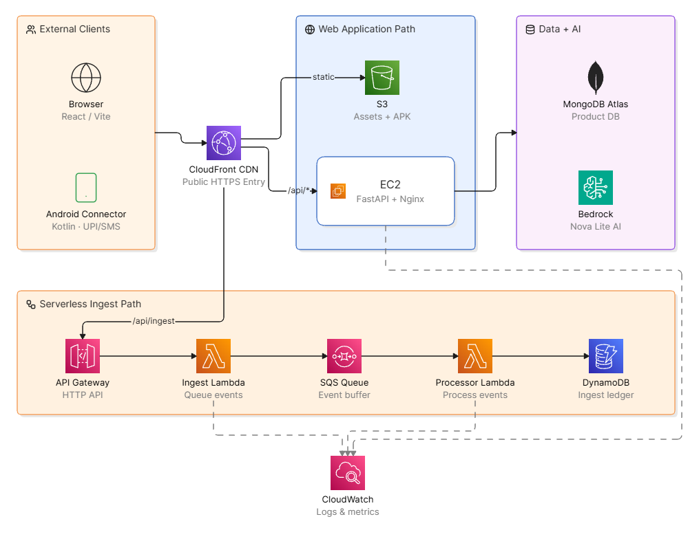

<div align="center">

# PocketBuddy

Campus financial guard for Indian students.

Passive UPI tracking, spending runway, companion Android sync, cart pooling, campus food intelligence, travel guidance, and AI-assisted nudges.

<p>
  <a href="https://d3g6cg7q9hn7hi.cloudfront.net/"><strong>Live Web App</strong></a>
  &nbsp;|&nbsp;
  <a href="https://d3g6cg7q9hn7hi.cloudfront.net/downloads/PocketBuddy-Connector-v0.1.0.apk"><strong>Download Android Connector</strong></a>
  &nbsp;|&nbsp;
  <a href="./android/releases/PocketBuddy-Connector-v0.1.0.apk"><strong>Repo APK</strong></a>
  &nbsp;|&nbsp;
  <a href="./docs/Initial-PRD.md"><strong>Product Requirements</strong></a>
  &nbsp;|&nbsp;
  <a href="./docs/aws-e2e-deployment-runbook.md"><strong>AWS Runbook</strong></a>
</p>

<p>
  <a href="#tech-stack"></a>
  <a href="#aws-architecture"></a>
  <a href="#android-connector"></a>
</p>

</div>

---

## Contents

- [Overview](#overview)
- [Demo Links](#demo-links)
- [What Is Built](#what-is-built)
- [User Flow](#user-flow)
- [AWS Architecture](#aws-architecture)
- [Repository Layout](#repository-layout)
- [Tech Stack](#tech-stack)
- [Local Development](#local-development)
- [Android Connector](#android-connector)
- [Companion Device Setup](#companion-device-setup)
- [Verification Commands](#verification-commands)
- [Deployment Notes](#deployment-notes)
- [Security And Privacy](#security-and-privacy)
- [Roadmap](#roadmap)
- [Project Docs](#project-docs)

---

## Overview

PocketBuddy is a hackathon prototype for students who spend through UPI, hostel food counters, subscriptions, quick-commerce orders, and shared room purchases. The product is designed around a low-friction first step: connect the Android phone once, let supported UPI/SMS notifications sync in the background, and turn that raw payment stream into useful financial context.

The platform combines:

- passive transaction capture from Android notifications;
- spending runway and dashboard insights;
- transaction review and categorization;
- companion-device setup and sync logs;
- quick-commerce cart pooling;
- campus food and travel guidance;
- Amazon Bedrock powered AI support where enabled;
- AWS-hosted demo infrastructure.

---

## Demo Links

| Surface | Link |
| --- | --- |
| Web app | [https://d3g6cg7q9hn7hi.cloudfront.net/](https://d3g6cg7q9hn7hi.cloudfront.net/) |
| Android connector APK, hosted | [PocketBuddy-Connector-v0.1.0.apk](https://d3g6cg7q9hn7hi.cloudfront.net/downloads/PocketBuddy-Connector-v0.1.0.apk) |
| Android connector APK, repo copy | [android/releases/PocketBuddy-Connector-v0.1.0.apk](./android/releases/PocketBuddy-Connector-v0.1.0.apk) |
| Mobile ingest endpoint | [CloudFront webhook route](https://d3g6cg7q9hn7hi.cloudfront.net/api/ingest/notification-v2) |
| AWS deployment guide | [docs/aws-e2e-deployment-runbook.md](./docs/aws-e2e-deployment-runbook.md) |
| Mobile ingest contract | [docs/mobile-ingest-contract.md](./docs/mobile-ingest-contract.md) |

> The Android APK is a sideloaded hackathon build. Android or Google Play Protect can warn because it is not distributed through Play Store and it requests notification access. Use only the hosted APK or the repository APK linked above.

---

## What Is Built

| Module | Status | Details |
| --- | --- | --- |
| Authentication | Built | Signup/login flow with user profile state. |
| Onboarding | Built | Student context, campus details, and preference capture. |
| Dashboard | Built | Cycle spend, runway, transactions, and feature entry points. |
| Transactions | Built | List, review, category handling, and normalized UPI events. |
| Android Connector | Built | Native Kotlin app that captures supported payment/SMS notifications. |
| Companion Device | Built | APK download, config copy, sync testing, and recent activity details. |
| Mobile Ingest | Built | Webhook path through CloudFront, API Gateway, Lambda, SQS, and DynamoDB. |
| Cart Pooling | Built | Quick-commerce pool flow and split-management UI. |
| Food Intelligence | Built | Campus food data and recommendation endpoints. |
| Travel Guidance | Built/early | Route/fare guidance exists; scale path is crowdsourced fare medians. |
| Bedrock/Nova | Built | Backend supports Amazon Nova Lite through Bedrock runtime when enabled. |
| AWS Hosting | Built | CloudFront/S3 frontend, EC2 backend, serverless ingest pipeline. |

---

## User Flow

```text
Student creates account
  -> completes onboarding
  -> opens Companion Device page
  -> downloads Android Connector APK
  -> taps One-Tap Auto Configure on the Android phone
  -> connector opens with server/account fields filled
  -> enables notification access
  -> supported UPI/SMS alerts sync into PocketBuddy
  -> dashboard, transactions, pools, and insights update
```

---

## AWS Architecture

The deployed demo uses AWS in two layers:

1. **Web application path** for the student-facing platform.
2. **Serverless ingest path** for mobile payment events.

<p align="center">
  
</p>

```text
Browser
  -> CloudFront
      -> S3 origin for React/Vite frontend assets
      -> EC2 origin for /api/* backend routes
      -> API Gateway origin for /api/ingest/notification-v2

Android Connector
  -> CloudFront /api/ingest/notification-v2
  -> API Gateway HTTP API
  -> Lambda ingest
  -> SQS queue
  -> Lambda processor
  -> DynamoDB ingest ledger

Main Backend
  -> EC2 Ubuntu
  -> Nginx reverse proxy
  -> FastAPI service
  -> MongoDB Atlas
  -> Amazon Bedrock Runtime when AI is enabled
```

### AWS Service Map

| AWS service | Current role |
| --- | --- |
| [Amazon S3](https://aws.amazon.com/s3/) | Stores frontend build output and downloadable APK artifact. |
| [Amazon CloudFront](https://aws.amazon.com/cloudfront/) | Public HTTPS entrypoint for frontend, API routing, and APK download. |
| [Amazon EC2](https://aws.amazon.com/ec2/) | Runs the main FastAPI backend behind Nginx. |
| [Amazon API Gateway](https://aws.amazon.com/api-gateway/) | Receives mobile notification webhooks. |
| [AWS Lambda](https://aws.amazon.com/lambda/) | Queues and processes serverless ingest events. |
| [Amazon SQS](https://aws.amazon.com/sqs/) | Buffers mobile notification events. |
| [Amazon DynamoDB](https://aws.amazon.com/dynamodb/) | Stores serverless ingest ledger records. |
| [Amazon Bedrock](https://aws.amazon.com/bedrock/) | Provides Nova Lite AI generation when enabled. |
| [Amazon CloudWatch](https://aws.amazon.com/cloudwatch/) | Logs and metrics for Lambda, SQS, EC2, and Nginx/service debugging. |
| [AWS Budgets](https://aws.amazon.com/aws-cost-management/aws-budgets/) | Hackathon account cost guardrails. |

See the full AWS runbook: [docs/aws-e2e-deployment-runbook.md](./docs/aws-e2e-deployment-runbook.md).

---

## Repository Layout

```text
PocketBuddy/
  android/                 Native Android connector Gradle project
  backend/                 FastAPI backend
  data/                    Demo/default data and seedable datasets
  docs/                    PRD, AWS runbooks, architecture, contracts, plans
  frontend/                React + Vite web application
  public/                  Static public assets
```

---

## Tech Stack

<table>
  <thead>
    <tr>
      <th>Layer</th>
      <th>Technology</th>
      <th>Purpose</th>
    </tr>
  </thead>
  <tbody>
    <tr>
      <td>Frontend</td>
      <td>React 19, Vite, TypeScript, TanStack Router, TanStack Query, Tailwind CSS, Lucide</td>
      <td>Student web app, dashboards, forms, onboarding, companion setup, pool UI</td>
    </tr>
    <tr>
      <td>Backend</td>
      <td>Python, FastAPI, Pydantic, Motor, PyMongo, Boto3</td>
      <td>Auth, profile, transactions, pools, food, travel, AI routes</td>
    </tr>
    <tr>
      <td>Database</td>
      <td>MongoDB Atlas, DynamoDB</td>
      <td>Main product data in MongoDB; serverless ingest ledger in DynamoDB</td>
    </tr>
    <tr>
      <td>Android</td>
      <td>Kotlin, Android Gradle Plugin, NotificationListenerService, OkHttp</td>
      <td>Payment/SMS notification capture and webhook sync</td>
    </tr>
    <tr>
      <td>Cloud</td>
      <td>CloudFront, S3, EC2, API Gateway, Lambda, SQS, Bedrock, CloudWatch</td>
      <td>Hosted demo, static assets, serverless ingest, AI, logs</td>
    </tr>
  </tbody>
</table>

---

## Local Development

<details>
<summary><strong>1. Install frontend dependencies</strong></summary>

```powershell
cd "C:\Users\nhnis\Desktop\Amazon Hackon\PocketBuddy\PocketBuddy"
npm.cmd install
```

</details>

<details>
<summary><strong>2. Configure backend environment</strong></summary>

```powershell
cd backend
py -m venv .venv
.\.venv\Scripts\Activate.ps1
python -m pip install -r requirements.txt
Copy-Item .env.example .env
```

Edit `backend/.env`:

```env
JWT_SECRET=<long-random-secret>
MONGO_URI=<mongodb-atlas-or-local-uri>
PORT=8000
AWS_REGION=ap-south-1
BEDROCK_ENABLED=false
BEDROCK_MODEL_ID=amazon.nova-lite-v1:0
```

Keep `.env` local. Do not commit secrets.

</details>

<details>
<summary><strong>3. Run backend</strong></summary>

```powershell
cd "C:\Users\nhnis\Desktop\Amazon Hackon\PocketBuddy\PocketBuddy\backend"
.\.venv\Scripts\Activate.ps1
uvicorn app.main:app --reload --port 8000
```

</details>

<details>
<summary><strong>4. Run frontend</strong></summary>

```powershell
cd "C:\Users\nhnis\Desktop\Amazon Hackon\PocketBuddy\PocketBuddy"
npm.cmd run dev --workspace=frontend
```

Open the local URL printed by Vite.

</details>

---

## Android Connector

The Android module is documented in [android/README.md](./android/README.md).

### Install The Demo APK

Use either of these links on the Android phone that receives UPI/SMS alerts:

- [Download from CloudFront](https://d3g6cg7q9hn7hi.cloudfront.net/downloads/PocketBuddy-Connector-v0.1.0.apk)
- [Download from this repository](./android/releases/PocketBuddy-Connector-v0.1.0.apk)

If Android blocks installation:

1. Open **Play Store**.
2. Tap profile icon.
3. Open **Play Protect**.
4. Open settings.
5. Temporarily disable app scanning.
6. Install PocketBuddy Connector from one of the links above.
7. Turn Play Protect scanning back on.

This is only for the hackathon sideload build. Do not ask users to keep Play Protect disabled.

### Build The Android Connector Locally

```powershell
cd "C:\Users\nhnis\Desktop\Amazon Hackon\PocketBuddy\PocketBuddy"

$env:JAVA_HOME = "C:\Program Files\Android\Android Studio\jbr"
$env:Path = "$env:JAVA_HOME\bin;$env:LOCALAPPDATA\Android\Sdk\platform-tools;$env:Path"

.\android\gradlew.bat -p android :connector:testDebugUnitTest :connector:assembleDebug
```

Install with ADB:

```powershell
$ADB = "$env:LOCALAPPDATA\Android\Sdk\platform-tools\adb.exe"
$DEVICE = "10BF821N3M0055M"

& $ADB -s $DEVICE install -r .\android\connector\build\outputs\apk\debug\connector-debug.apk
```

---

## Companion Device Setup

1. Login to the [web app](https://d3g6cg7q9hn7hi.cloudfront.net/).
2. Open **Settings -> Companion Device**.
3. Download the Android APK from the install card.
4. Open PocketBuddy web on the Android phone and tap **One-Tap Auto Configure**.
5. Confirm the connector shows the linked account.
6. Open notification access settings from the app.
7. Enable notification access for PocketBuddy Connector.
8. Make a small UPI transaction or use a debug broadcast.
9. Return to the web app and check **Recent Sync Activity**.

If the app link cannot open the connector, use **Copy fallback config** from the Companion Device page.

---

## Verification Commands

| Check | Command |
| --- | --- |
| Frontend type-check | `npm.cmd run check --workspace=frontend` |
| Frontend build | `npm.cmd run build --workspace=frontend` |
| Backend syntax | `python -m compileall backend\app` |
| Android tests/build | `.\android\gradlew.bat -p android :connector:testDebugUnitTest :connector:assembleDebug` |
| Git whitespace | `git diff --check` |

---

## Deployment Notes

<details>
<summary><strong>Frontend deployment to S3 and CloudFront</strong></summary>

Build:

```powershell
npm.cmd run build --workspace=frontend
```

Upload the contents of:

```text
frontend/dist/
```

to:

```text
s3://pocketbuddy-frontend-734705208425-ap-south-1/
```

Create a CloudFront invalidation:

```text
/*
```

</details>

<details>
<summary><strong>Backend deployment on EC2</strong></summary>

```bash
cd /home/ubuntu/PocketBuddy
git pull --ff-only origin main
cd backend
.venv/bin/pip install -r requirements.txt
sudo systemctl restart pocketbuddy-backend
sudo systemctl status pocketbuddy-backend --no-pager
```

</details>

<details>
<summary><strong>Android APK artifact</strong></summary>

Store the signed APK at:

```text
s3://pocketbuddy-frontend-734705208425-ap-south-1/downloads/PocketBuddy-Connector-v0.1.0.apk
```

Public URL:

```text
https://d3g6cg7q9hn7hi.cloudfront.net/downloads/PocketBuddy-Connector-v0.1.0.apk
```

Repository copy:

```text
android/releases/PocketBuddy-Connector-v0.1.0.apk
```

Do not share unsigned or intermediate APK files such as:

```text
PocketBuddy-Connector-v0.1.0-release-aligned.apk
```

Do not commit local signing material or scratch artifacts such as:

```text
scratch/android-signing/*.jks
scratch/android-signing/*password*
scratch/android-release/*.idsig
```

</details>

---

## Security And Privacy

- Never commit `.env`, keystores, MongoDB passwords, JWT secrets, AWS credentials, or local signing passwords.
- Keep Android notification access transparent to users; the connector exists only to detect supported payment/SMS alerts.
- Mask account numbers, phone numbers, UTRs, and links before showing notification previews.
- Keep Play Protect disabled only temporarily when installing the known hackathon APK.
- Use server-side idempotency for mobile events to avoid duplicate transactions.
- Keep AWS Budgets and billing alerts enabled while demo resources are active.

---

## Roadmap

PocketBuddy should keep useful demo defaults without becoming hardcoded to one campus or one user.

| Area | Next step |
| --- | --- |
| Food data | Menu photo scanner using S3, Textract, Nova Lite, and student verification votes. |
| Travel | Crowdsourced route medians plus current booking-app quote input for surge-aware negotiation targets. |
| Categories | Parent category model with custom user labels for clean analytics. |
| Subscriptions | Interval clustering to detect recurring merchants beyond static service lists. |
| Parser quality | Feedback loop for failed or low-confidence SMS/notification formats. |
| Cart pools | Auto-verify roommate repayments from incoming UPI credit notifications. |

---

## Project Docs

| Document | Purpose |
| --- | --- |
| [docs/Initial-PRD.md](./docs/Initial-PRD.md) | Original product requirements and feature framing. |
| [docs/aws-e2e-deployment-runbook.md](./docs/aws-e2e-deployment-runbook.md) | Full AWS deployment notes and configuration. |
| [docs/aws-low-cost-setup.md](./docs/aws-low-cost-setup.md) | Beginner AWS cost-safety guide. |
| [docs/mobile-ingest-contract.md](./docs/mobile-ingest-contract.md) | Android-to-backend webhook contract. |
| [docs/final-architecture-decisions.md](./docs/final-architecture-decisions.md) | Current architecture decisions. |
| [android/README.md](./android/README.md) | Android connector setup, build, and test guide. |

---

## License

Hackathon prototype. Add a production license before public open-source release.
