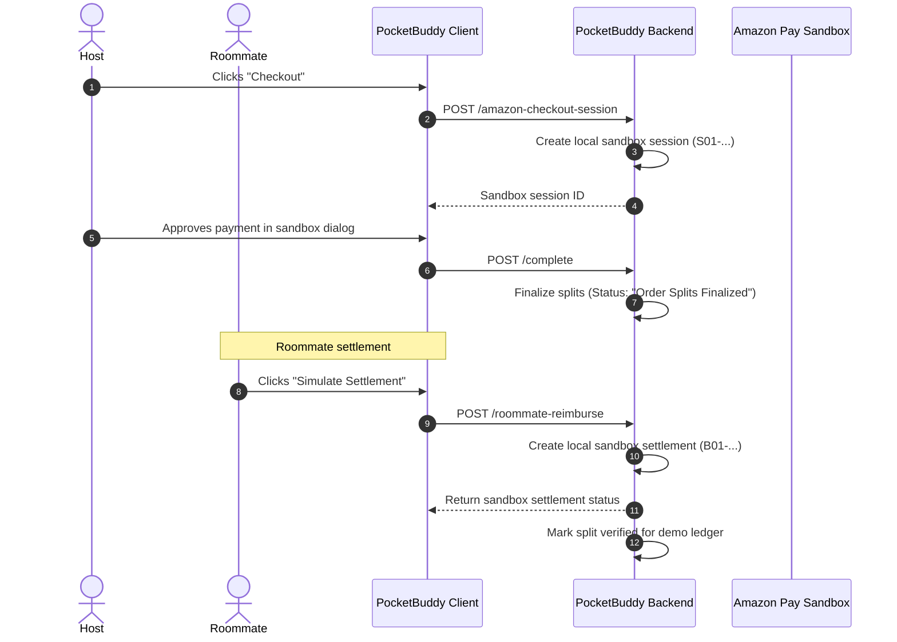

# Cart Pooling Module: Strategy & Feature Matrix

This document tracks the features, requirements, and mentor feedback items for the **Cart Pooling** module of PocketBuddy, mapping them to their verified implementation in the codebase.

---

## 1. Core Feature Matrix

| Strategy Guide Requirement | Implementation Status | Codebase References / Files |
| :--- | :--- | :--- |
| **1. Wing Reliability Scores** | **Fully Implemented** | [pools.py:L153-273](file:///C:/Users/nhnis/Desktop/Amazon%20Hackon/PocketBuddy/PocketBuddy/backend/app/api/pools.py#L153-L273) (calculates score and category); `pool.reliability_scores` returned in detail endpoint. |
| **2. Dynamic wing debt-netting** | **Fully Implemented** | [pools.py:L409-505](file:///C:/Users/nhnis/Desktop/Amazon%20Hackon/PocketBuddy/PocketBuddy/backend/app/api/pools.py#L409-L505) (`/api/cart-pools/wing/netted-balances` resolves cycle balances). |
| **3. Runway Spend impact (Debts)** | **Fully Implemented** | [insights.py:L123-149](file:///C:/Users/nhnis/Desktop/Amazon%20Hackon/PocketBuddy/PocketBuddy/backend/app/api/insights.py#L123-L149) (adds unpaid debts to monthly cycle spending). |
| **4. Settle-in-kind (Cash-free mode)** | **Fully Implemented** | [pools.py:L734-755](file:///C:/Users/nhnis/Desktop/Amazon%20Hackon/PocketBuddy/PocketBuddy/backend/app/api/pools.py#L734-L755) (settlement mode `"settle_in_kind"`); [pool.$id.tsx:L1172](file:///C:/Users/nhnis/Desktop/Amazon%20Hackon/PocketBuddy/PocketBuddy/frontend/src/routes/pool.$id.tsx#L1172) (Host click action). |
| **5. Soft consequence (Block Hosting)** | **Fully Implemented** | [pools.py:L72-91](file:///C:/Users/nhnis/Desktop/Amazon%20Hackon/PocketBuddy/PocketBuddy/backend/app/api/pools.py#L72-L91) (prevents starting a pool if outstanding wing debts exist). |
| **6. Opt-in WhatsApp AI Nudges** | **Fully Implemented** | [pools.py:L902-985](file:///C:/Users/nhnis/Desktop/Amazon%20Hackon/PocketBuddy/PocketBuddy/backend/app/api/pools.py#L902-L985) (handles Twilio sandbox/Meta API with manual click fallbacks). |

---

## 2. Amazon Pay Sandbox Contract Flow

Rather than claiming live payment rails in the prototype, PocketBuddy models an **Amazon Pay V2-style sandbox contract** for checkout and split-settlement demos:

---

## 3. Resolving Mentor Concerns

### A. "What if the Host forgets their UPI address?"
*   **The Problem:** Roommates cannot make manual UPI payments if `pool.upi_id` is empty.
*   **The Solution:** 
    1.  The roommate can use the **Amazon Pay sandbox settlement** in the demo, while real settlement remains UPI/UTR or passive host-credit verification.
    2.  For manual payments, a **WhatsApp Contact** button is displayed inside the warnings card, opening a direct message pre-filled with a VPA reminder linked to the host's phone number.

### B. "Can roommates pay when logged in as themselves?"
*   **The Problem:** The app previously identified active users as the host incorrectly, causing roommate payment screens to render host verification triggers.
*   **The Solution:** The logic was refactored so that `"you"` refers to the roommate's ledger partition, ensuring the settlement panels render correctly for non-host participants.
